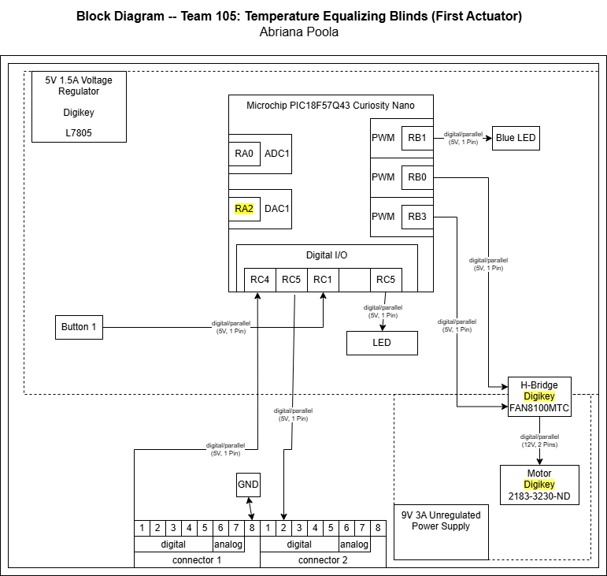

## Overview
The purpose of this block diagram is to showcase the motor system (acuator) of the main project of Team 105. The motors serve as a way for the blinds to be in motion with the other three functionalities (Motion Sensor, Light Sensor, and Thermometers) hooked to the main connector with one another.

## Block Diagram 

## Links

[Draw.io Link](https://app.diagrams.net/?src=about#G1hMjAJW7opRf4J--dhk38g8VkFsdgjR2x#%7B%22pageId%22%3A%22ZS_szoeRyAuTDWHuVXxn%22%7D)