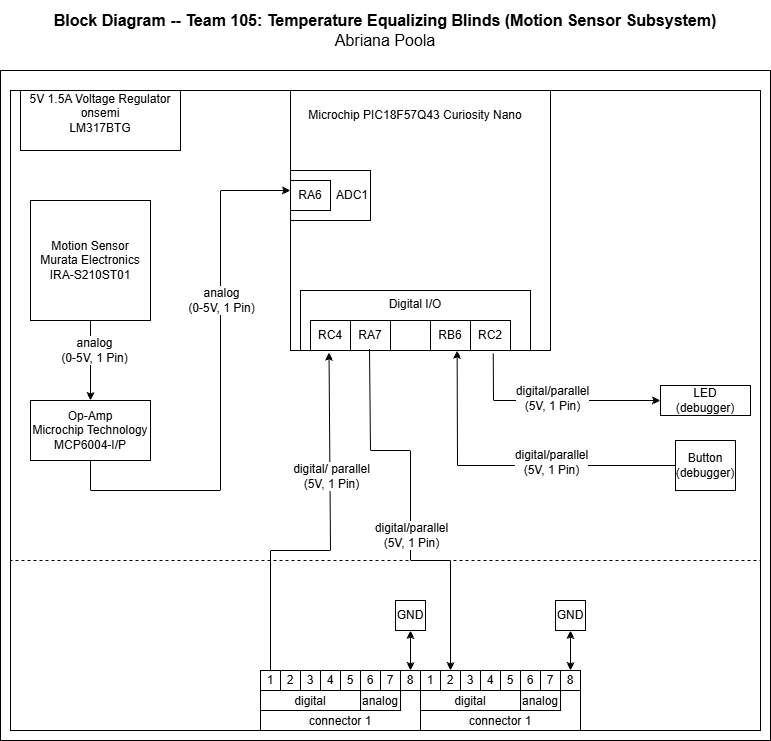

## Overview
The purpose of this block diagram is to showcase the motion sensor portion of the temperature equalizing blinds. With the motion sensor, it would recieve the output from the thermoresistor sensor from the first pinout in the first connector. The motion sensor contains the information of the average temperature which allows the motion sensor to determine if the actuator moves. If the value is 1, the actuator moves with the motion sensor determining if it continues until an object/person/pet is in the way, which in turn stops.

## Block Diagram 

## Links

[Draw.io Link](https://app.diagrams.net/?src=about#G1hWknXkYhTK44SRYjbAGi2VlzYAB6XzGP#%7B%22pageId%22%3A%22ZS_szoeRyAuTDWHuVXxn%22%7D)