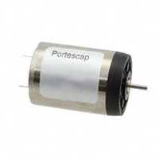
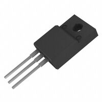
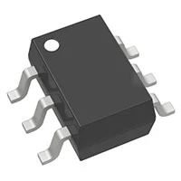

**H-bridge**

1. Brush DC Motor Controller

    

    * $1.16/each
    * [FAN8100N](https://www.digikey.com/en/products/detail/fairchild-semiconductor/FAN8100N/11558200)

    | Pros                                      | Cons                                                             |
    | ----------------------------------------- | ---------------------------------------------------------------- |
    | Inexpensive                               | Would need to code in depth with other portions                  |
    | Has high thermal capailities              | Would need to see if it would be enough for the project          |
    | Has four function channels (Forward/Reverse/Stop/Brake) |

1. PWM Chopper Type DC Brushed Motor Driver

    

    * $1.29/each
    * [TB67H451FNG](https://www.digikey.com/en/products/detail/toshiba-semiconductor-and-storage/TB67H451FNG-EL/11568781)

    | Pros                                                              | Cons                |
    | ----------------------------------------------------------------- | ------------------- |
    | Has a realization of high voltage and large current drive         | Only 13 cents more expensive    |
    | Has built-in various error detections                             | On the documentation, it is not recommended for new design |
    |                                                                   | Need to be careful with thermal condition |

**Choice:** Option 1: Brush DC Motor Controller (FAN8100N)

**Rationale:** An H-bridge is one of the few ways to control a DC Motor and making it move in 4 directions (Forward/Reverse/Brake/Stop). With option 1, the part is inexpensive compared to several other h-bridges and it is something that is familiar within the course. Furthermore, it can handle the thermal heat which is important as heat can be created by rapid movement which posses a safety issue with user if it reaches to a certain temperature.

**DC Motors**

1. Brushed DC Motor Standard 12850 RPM 12VDC

    

    * $5.22/each
    * [PAN14EE12AA1](https://www.digikey.com/en/products/detail/nmb-technologies-corporation/PAN14EE12AA1/2417070)

    | Pros                                      | Cons                                                             |
    | ----------------------------------------- | ---------------------------------------------------------------- |
    | Inexpensive                               | Requires external components and support circuitry for interface |
    | Is within the voltage output for the PIC  | Smaller than what is needed                                      |

1. Standard Motor 10000 RPM 6V

    

    * $78/each
    * [22N28-216E.286](https://www.digikey.com/en/products/detail/portescap/22N28-216E-286/5232871)

    | Pros                                                              | Cons                |
    | ----------------------------------------------------------------- | ------------------- |
    | Has high RPM                                      | Too expensive for this project      |
    | Sizing is ideal for the electric blinds                           |

**Choice:** Option 1: Brushed DC Motor Standard 12850 RPM 12VDC

**Rationale:** A DC motor is the main component for the Team 105's acuator. As such, motors tend to be very expensive if not carefully selected as shown in option 2. With option 1, it would be compatible with our main project as it's voltage output is within the bounds of the PIC Microcontroller. Despite option 1 being choosen, there will need further research for other possible motors that would be big enough as this DC motor is too tiny for the project.  

**MOSEFETS**

1. MOSFET N-CH 60V 7A/22A TO220-3F

    

    * $1.66/each
    * [AOTF2618Lt](https://www.digikey.com/en/products/detail/alpha-omega-semiconductor-inc/AOTF2618L/3603382)

    | Pros                                      | Cons                                                             |
    | ----------------------------------------- | ---------------------------------------------------------------- |
    | Inexpensive and compatible with motor     | Prone to overheating fast |
    | Conduction and switching PWR losses are minimized                     | Vulnerable to ESD and overvoltage                                       |

1. MOSFET N/P-CH 30V 3.8A TSOT26

    

    * $0.42/each
    * [DMG6601LVT-7](https://www.digikey.com/en/products/detail/diodes-incorporated/DMG6601LVT-7/3678130)

    | Pros                                                              | Cons                |
    | ----------------------------------------------------------------- | ------------------- |
    | Fast switching speed                                              | Would need to look into the voltage   |
    | Inexpensive                                                       | Would need to solder  |

**Choice:** Option 1: MOSFET N-CH 60V 7A/22A TO220-3F

**Rationale:** Despite option 2 would be ideal as it's inexpensive, option 1 is the ultimate choice as it is known to funtion with the PIC microcontroller without possible damage. Furthermore, option 2 would involve soldering and a seperate PCB to function which is beyound what is taught in the 304 course. 
