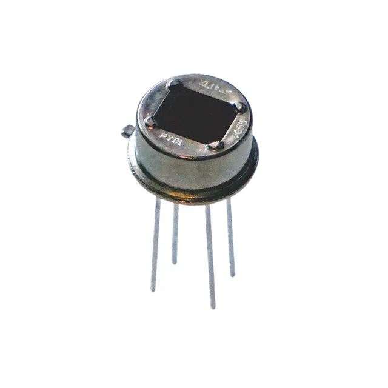
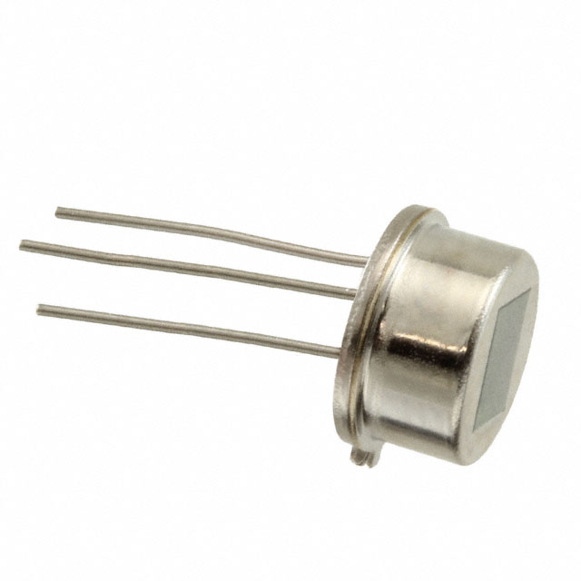
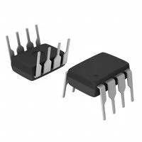

**Motion Sensors**

1. Sensor PIR(Passive Infrared) Low Power

    

    * $5.03/each
    * [PYD1598](https://www.digikey.com/en/products/detail/fairchild-semiconductor/FAN8100N/11558200)

    | Pros                                      | Cons                                                             |
    | ----------------------------------------- | ---------------------------------------------------------------- |
    | Has four pins                             | Expensive                                                        |
    | Has a touchless switch                    | Low-power consumption of only 3mA at 1.8V                        |
    | Has a digital interface for detector configuration | Only can detect through pyroceramic                     |

1. Sensor PIR (Passive Infrared) Radial, Metal Can, Lensed - 3 Lead

    

    * $2.17/each
    * [IRAS210ST01](https://www.digikey.com/en/products/detail/murata-electronics/IRA-S210ST01/5012561)

    | Pros                                                              | Cons                |
    | ----------------------------------------------------------------- | ------------------- |
    | Uses pyroelectric effect of pyroelectric ceramics                 | Would need to test for three items (Responsivity, white noise, and source voltage)    |
    | Can handle 2.0 to 15.0 V of VDC power                             | Need to be careful of placement |
    | Has a detailed datasheet                                          |                     |

1. IR Emitter

    

    * $4.16/each
    * [OPB732](https://www.digikey.com/en/products/detail/tt-electronics-optek-technology/OPB732/1637069)

    | Pros                                                              | Cons                |
    | ----------------------------------------------------------------- | ------------------- |
    | Has both Infrared LED and Photoresistor                           | Expensive           |
    | Something familiar                                                | Layout of pins is confusing        |
    | Uses Light value                                                  |                     |

**Choice** 
Option 3 - IR Emitter

**Rationale** 
Though many motion sensors use PIR Sensors to sense objects through heat, the IR Emitter uses light sensors and is something that was taught within the course. Despite being expensive compared to the other two options, the IR Emitter was given in the course which testing would be a lot easier to get it working for the main project.

**OP-AMP**

1. Standard (General Purpose) Amplifier 4 Circuit Rail-to-Rail 14-PDIP

    

    * $0.59/each
    * [op_amp](https://www.digikey.com/en/products/detail/microchip-technology/MCP6004-I-P/523060?s=N4IgTCBcDaILYGMAOA2ADGgLAWgJYHokQBdAXyA)

    | Pros                                      | Cons                                                             |
    | ----------------------------------------- | ---------------------------------------------------------------- |
    | Inexpensive                               | Requires external components and support circuitry for interface |
    | Has 14 pins |                                                           |
    | Detailed datasheet          |                                                                  |

1. 8-Prong Op-Amp

    

    * $0.77/each
    * [TL071ACP](https://www.digikey.com/en/products/detail/texas-instruments/TL071ACP/378370?gclsrc=aw.ds&gad_source=1&gad_campaignid=17336967819&gbraid=0AAAAADrbLlgTcsxonNtgcFPO34hVIdP1s&gclid=Cj0KCQiAi9rJBhCYARIsALyPDtspATbE4TVAVirLXVvDT02yyz5SbZvDr89mPsYKyx_bwr2-w_l64mUaAi7FEALw_wcB)

    | Pros                                      | Cons                                                             |
    | ----------------------------------------- | ---------------------------------------------------------------- |
    | Has dual channels                         | A little expensive                  |
    | Small                                     | There are offsets that need to be consider                       |

**Choice** 
Option 1 - Standard (General Purpose) Amplifier 4 Circuit Rail-to-Rail 14-PDIP

**Rationale**
Option 1 allows a multitude of logic gates (4) which is helpful for the IR Emitter. Though the second option could be helpful for the spacing, option 1 have different gates that can be switched over just in case for different scenerios.

## Summary

|IR Emitter| $4.16|
|14-PDIP Op Amp| $0.59|

These two items are both critical for the main project that would help me achieve the goal of having a motion sensor by using light values for the actuator. 

