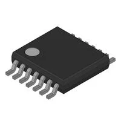

**H-bridge**

1. Brush DC Motor Controller

    

    * $1.16/each
    * [FAN8100N](https://www.digikey.com/en/products/detail/fairchild-semiconductor/FAN8100N/11558200)

    | Pros                                      | Cons                                                             |
    | ----------------------------------------- | ---------------------------------------------------------------- |
    | Inexpensive                               | Would need to code in depth with other portions                  |
    | Has high thermal capailities              | Would need to see if it would be enough for the project          |
    | Has four function channels (Forward/Reverse/Stop/Brake) |

1. PWM Chopper Type DC Brushed Motor Driver

    

    * $1.29/each
    * [TB67H451FNG](https://www.digikey.com/en/products/detail/toshiba-semiconductor-and-storage/TB67H451FNG-EL/11568781)

    | Pros                                                              | Cons                |
    | ----------------------------------------------------------------- | ------------------- |
    | Has a realization of high voltage and large current drive         | Only 13 cents more expensive    |
    | Has built-in various error detections                             | On the documentation, it is not recommended for new design |
    |                                                                   | Need to be careful with thermal condition |

**Choice:** Option 1: Brush DC Motor Controller (FAN8100N)

**Rationale:** An H-bridge is one of the few ways to control a DC Motor and making it move in 4 directions (Forward/Reverse/Brake/Stop). With option 1, the part is inexpensive compared to several other h-bridges and it is something that is familiar within the course. Furthermore, it can handle the thermal heat which is important as heat can be created by rapid movement which posses a safety issue with user if it reaches to a certain temperature.

**DC Motors**

1. GEARMOTOR 251 RPM 12V W/ENCODER

    

    * $16.50/each
    * [1738-1106-ND](https://www.digikey.com/en/products/detail/dfrobot/FIT0186/6588528)

    | Pros                                      | Cons                                                             |
    | ----------------------------------------- | ---------------------------------------------------------------- |
    | Inexpensive                               | Requires external components and support circuitry for interface |
    | Has the right amount of RPM and Voltage too work |                                    |
    | Has an encoder within the motor           |

1. GEARMOTOR 110 RPM 12V METAL

    

    * $33.95/each
    * [2183-3253-ND](https://www.digikey.com/en/products/detail/pololu/3253/10450104)

    | Pros                                                              | Cons                |
    | ----------------------------------------------------------------- | ------------------- |
    | Has low RPM which is ideal                                     | Almost half the budget (expensive)     |
    | Sizing is ideal for the electric blinds                           |

1. Brushed DC Motor Standard 12850 RPM 12VDC

    

    * $5.22/each
    * [PAN14EE12AA1](https://www.digikey.com/en/products/detail/nmb-technologies-corporation/PAN14EE12AA1/2417070)

    | Pros                                      | Cons                                                             |
    | ----------------------------------------- | ---------------------------------------------------------------- |
    | Inexpensive                               | RPM doesn't match the first actuator's requirement               |
    | Is within the voltage output for the PIC  | Smaller than what is needed                                      |

**Choice:** Option 2: GEARMOTOR 110 RPM 12V METAL

**Rationale:** 
Option 2 gearmotor is the ideal choice as it's a DC motor that meets the requirements for the project. The RPM is 110 and is made out of metal as it shows that's it is sturdy enough to handle the weight and pressure of the main project. All though it it $33.95 which is pricey, it fits within the product budget. Furthermore, the motor can easily connect to the board unlike the first option.