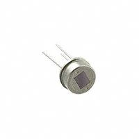
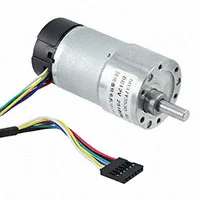
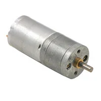
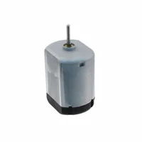

**Motion Sensors**

1. Sensor PIR(Passive Infrared) Low Power

    

    * $5.03/each
    * [PYD1598](https://www.digikey.com/en/products/detail/fairchild-semiconductor/FAN8100N/11558200)

    | Pros                                      | Cons                                                             |
    | ----------------------------------------- | ---------------------------------------------------------------- |
    | Has four pins                             | Expensive                                                        |
    | Has a touchless switch                    | Low-power consumption of only 3mA at 1.8V                        |
    | Has a digital interface for detector configuration | Only can detect through pyroceramic                     |

1. Sensor PIR (Passive Infrared) Radial, Metal Can, Lensed - 3 Lead

    

    * $2.17/each
    * [IRAS210ST01](https://www.digikey.com/en/products/detail/murata-electronics/IRA-S210ST01/5012561)

    | Pros                                                              | Cons                |
    | ----------------------------------------------------------------- | ------------------- |
    | Uses pyroelectric effect of pyroelectric ceramics                 | Would need to test for three items (Responsivity, white noise, and source voltage)    |
    | Can handle 2.0 to 15.0 V of VDC power                             | Need to be careful of placement |
    | Has a detailed datasheet                                          |                     |
    
1. Sensor PIR (Passive Infrared) Dual Element TO-5-3 Lens Top Metal Can

    

    * $1.24/each
    * [ZRE200GE](https://www.digikey.com/en/products/detail/zilog/ZRE200GE/5147335)

    | Pros                                                              | Cons                |
    | ----------------------------------------------------------------- | ------------------- |
    | Has high PSRR                                                     | Source Voltage is between 0.3 V to 1.4 V    |
    | Can handle 2.0 to 15.0 V of VDC power                             | Cannot operate where there is obstructing materials|
    | Has multiple detailed documents                                   | Cannot be exposed to direct sunlight/ automobile headlights                     |

**Choice:** Option 2 - Sensor PIR (Passive Infrared) Radial, Metal Can, Lensed - 3 Lead

**Rationale:** 

**DC Motors**

1. GEARMOTOR 251 RPM 12V W/ENCODER

    

    * $16.50/each
    * [1738-1106-ND](https://www.digikey.com/en/products/detail/dfrobot/FIT0186/6588528)

    | Pros                                      | Cons                                                             |
    | ----------------------------------------- | ---------------------------------------------------------------- |
    | Inexpensive                               | Requires external components and support circuitry for interface |
    | Has the right amount of RPM and Voltage too work |                                    |
    | Has an encoder within the motor           |

1. GEARMOTOR 110 RPM 12V METAL

    

    * $33.95/each
    * [2183-3253-ND](https://www.digikey.com/en/products/detail/pololu/3253/10450104)

    | Pros                                                              | Cons                |
    | ----------------------------------------------------------------- | ------------------- |
    | Has low RPM which is ideal                                     | Almost half the budget (expensive)     |
    | Sizing is ideal for the electric blinds                           |

1. Brushed DC Motor Standard 12850 RPM 12VDC

    

    * $5.22/each
    * [PAN14EE12AA1](https://www.digikey.com/en/products/detail/nmb-technologies-corporation/PAN14EE12AA1/2417070)

    | Pros                                      | Cons                                                             |
    | ----------------------------------------- | ---------------------------------------------------------------- |
    | Inexpensive                               | RPM doesn't match the first actuator's requirement               |
    | Is within the voltage output for the PIC  | Smaller than what is needed                                      |

**Choice:** Option 2: GEARMOTOR 110 RPM 12V METAL

**Rationale:** 
Option 2 gearmotor is the ideal choice as it's a DC motor that meets the requirements for the project. The RPM is 110 and is made out of metal as it shows that's it is sturdy enough to handle the weight and pressure of the main project. All though it it $33.95 which is pricey, it fits within the product budget. Furthermore, the motor can easily connect to the board unlike the first option.