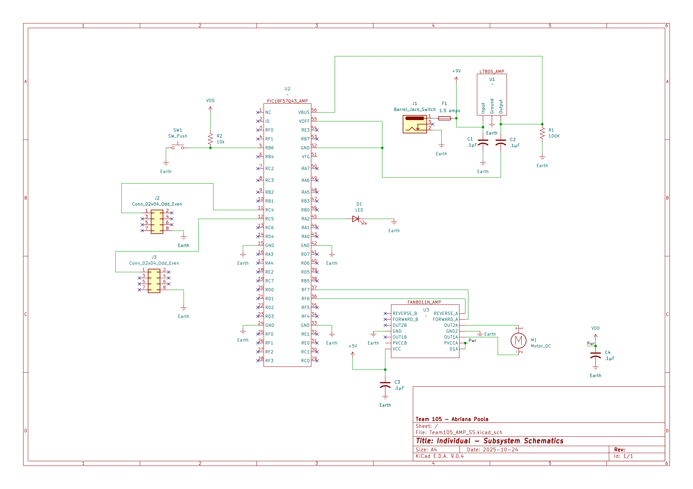

## Overview

This schematic is design of the first acuator that would roll the blinds up/down. Within the schematic, it showcases the motor being connected to the H-bridge which is linked to the PIC microcontroller. Furthermore, there is a connector that would link to the second acuator and the thermometer. The thermometer, it would tell the acuator to raise/lower the blinds dependent on the temperature of both the inside and outside of the house. With that, the connector on this board would tell the second acuator to adjust the blind's sliders with the second motor.

{style width:"350" height:"300;"}
**Figure 1:** Electric Blind's First Acuator

## Resouces

The schematic as a PDF download is available [*here*](Team105_AMP_SS.pdf), and the Zip folder of the project [*here*](Team105_AMP_SS_zip).