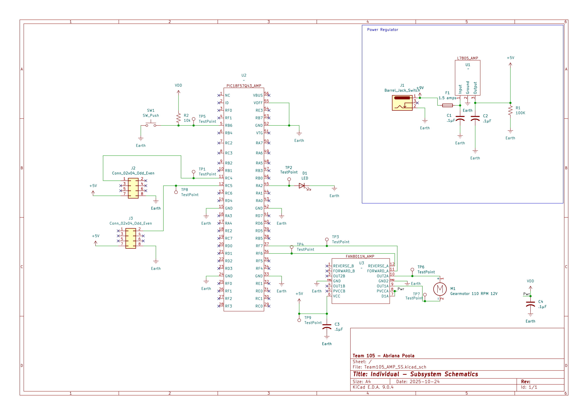

## Overview

This schematic is design of the IR Emitter Detector Pair sensor that would act as a motion sensor based on the value of light covering the sensor. As the blinds goes down, this sensor will be attached to the bottom of the blinds so once it hits a value with the light source, it would stop the motor until next action.

{style width:"350" height:"300;"}
**Figure 1:** Electric Blind's First Actuator

## Resouces

The schematic as a PDF download is available [*here*](Team105_AMP_SS.pdf), and the Zip folder of the project [*here*](Team105_AMP_SS.zip).