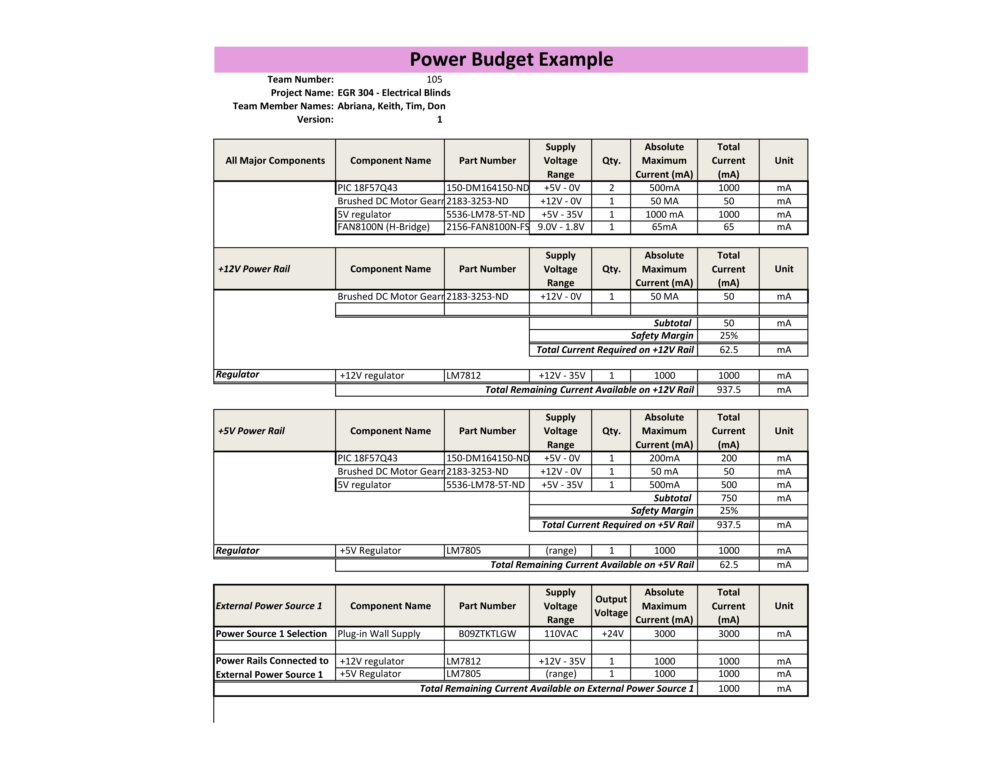

## Overview
From the image below, the power budget was created by four major components: motor, h-bridge, PIC, and regulator. With that, each one was placed into different power rails that the component would use to help calculate the amps used for the circuit board. With the amps provided by the datasheet, this allowed the knowledge of voltage required to power of the board dependent on which power rail each component is connected too. 

{style width:"350" height:"300;"}

## Conclusions

From the prepare Power Budget, it was calcuated that there should be at least 1000 mA left over from the project. This gives us an idea how much the board can handle if there was ever a system expansion. Furthermore, it would allow the board to have a larger safety margin thanks to available capacity calculated by the Power Budget.

## Resouces

The power budget as a PDF download is available [*here*](105_PowerBudget.pdf), and a Microsoft Excel Sheet [*here*](https://1drv.ms/x/c/71420322b1691527/EY8NGMndpP9LlLxGcqphVMIBvIOyInlZ4xRqcvrF40yyvg?e=WposaN).