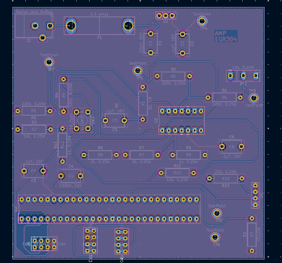

## Introduction

From the schematic, the PCB of the IR Emitter was created while keeping in the mind the rules of PCB design. Down below are two figures that show the top and bottom portions of the PCB Design.

{style width:"350" height:"300;"}

**Figure 1:** Top Portion of PCB

{style width:"350" height:"300;"}

**Figure 1:** Top Portion of PCB

## Resouces

The schematic as a PDF download is available [*here*](PCB_PDF.pdf), and the Zip folder of the project [*here*](AMP_Gerber.zip).